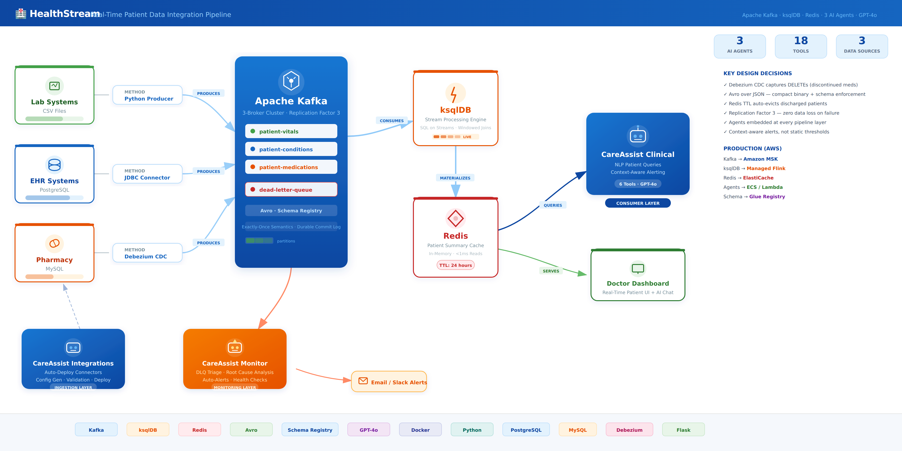

# HealthStream v2 - Real-Time Healthcare Decision Intelligence

A production-grade platform that takes a hospital from monitoring to decision intelligence, fusing real-time patient vitals with machine-learning risk predictions into a single ranked action list.

Kafka streaming -> Snowflake Cortex ML -> closed-loop scoring -> role-based decision dashboard -> 4 GPT-4o agents

Note: All data is synthetic (Synthea). Accuracy figures illustrate the method, not clinical results.

---

## What It Does

Most hospital systems are good at monitoring. HealthStream v2 goes one step further, fusing two signals that normally live in separate systems:

- Acute signal: live vitals streaming through Kafka (what is wrong right now)
- Chronic signal: readmission risk from a Snowflake Cortex ML model (what is likely next)

These combine into a ranked Action Priority Queue that tells clinicians who to see first and why.

## Architecture - Three Layers, Four Audiences

Layer 1 - Real-Time Operations: CSV -> Python producer (Avro-validated) -> Kafka (3 brokers) -> ksqlDB -> materializer -> Redis -> dashboard

Layer 2 - Lakehouse + ML: Snowflake (RAW / ANALYTICS / ML schemas) + Cortex model predicting 30-day readmission risk, trained in SQL inside the warehouse

Layer 3 - Decision Intelligence: Action Queue, risk explainability, financial impact, and 4 AI agents

Serves four roles: Doctor (Action Queue), Analyst (Analytics Assistant), Engineer (reliability + DLQ), Leadership (Executive Command Center)

## Key Features

- Closed-loop scoring: risk scores flow Snowflake -> Kafka -> Redis -> dashboard, back to the bedside
- Action Priority Queue: fuses acute + chronic signals into one ranked list with recommended actions
- Risk explainability: every score traces to factors (prior admissions, conditions, age) vs cohort average
- Executive Command Center: live leadership view - readmission rate, at-risk population, penalty exposure, avoidable cost
- 4 GPT-4o agents: role-aware clinical/operations assistant, plain-English-to-Snowflake analytics assistant, data-onboarding agent, data-quality monitor
- Data quality: Avro + Schema Registry validation, dead-letter queue with error diagnosis
- 3 ingestion patterns: custom producer, JDBC Source Connector, Debezium CDC

## Tech Stack

Apache Kafka, ksqlDB, Avro / Schema Registry, Snowflake + Cortex ML, Redis, Flask, GPT-4o, Docker, Python, SQL

Production path (Docker -> AWS): MSK, Managed Flink, ElastiCache, ECS/Lambda, Glue Schema Registry

## Project Structure

producer/            CSV producer (Avro-validated Kafka publisher)
context-engine/      Materializer: Kafka to Redis patient context
dashboard/           Flask API + role-based dashboard (provider/admin/executive)
agent/               4 GPT-4o agents
connectors/          JDBC + Debezium source connectors
schemas/             Avro schemas
databases/           Postgres + MySQL init
monitoring/          Health monitor
security/            Kafka ACLs
risk_score_publisher.py / risk_score_consumer.py   Closed-loop scoring
docker-compose.yml   10-container infrastructure

## Quick Start

1. Start infrastructure: docker compose up -d
2. Set up environment: python -m venv venv, source venv/bin/activate, pip install -r requirements.txt
3. Run the pipeline:
   python producer/csv_producer.py
   python context-engine/context_materializer.py
   python dashboard/api.py   (dashboard at localhost:5050)

Requires a .env file with SNOWFLAKE_* and OPENAI_API_KEY variables. Secrets are never committed.

## Author

Revanth Kumar Potu - Data Engineer
AWS Certified Data Engineer Associate - Azure Data Engineer Associate - Snowflake SnowPro Core
